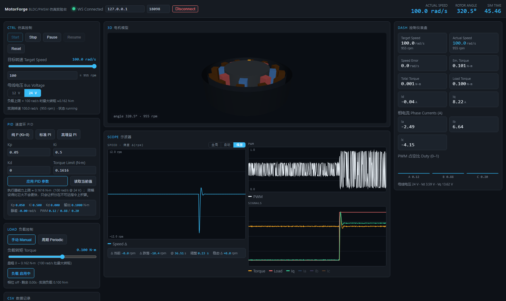

<div align="center">

# ⚡ MotorForge

**BLDC / PMSM 电机控制 Web 仿真实验台**

[](./LICENSE)
[]()
[]()
[]()
[]()

上游物理内核 [markisus/motor_sim](https://github.com/markisus/motor_sim) **一行未改**，
MotorForge 在其上补齐 C++ Adapter、WebSocket 实时服务与 React 可视化前端。

</div>

---

## 📖 目录

- [这是什么](#-这是什么)
- [界面](#-界面)
- [架构](#-架构)
- [快速开始](#-快速开始)
- [速度环整定指南](#-速度环整定指南必读)
- [WebSocket 协议](#-websocket-协议)
- [验证与验收](#-验证与验收)
- [故障排查](#-故障排查)
- [目录结构](#-目录结构)
- [版本记录](#-版本记录)
- [致谢与许可](#-致谢与许可)

---

## 🤔 这是什么

一个跑在浏览器里的**电机控制实验台**：真实 1 MHz 定步长电机模型 + FOC 电流环，
在网页上调 PID、加负载、看波形，所有显示量都来自同一份仿真快照。

| 你会用到它来 | 说明 |
|---|---|
| **观察速度环动态** | 加阻力 → 先跌落后回归；去掉积分（Ki=0）→ 永久静差，一眼看清 PID 在做什么 |
| **整定 PID** | Kp / Ki / Kd / 转矩限幅在线可改、实时回读，内置三档预设 |
| **验证控制器设计** | 周期负载、母线电压 12/24 V、目标转速阶跃，均可脚本化复现 |
| **做教学演示** | 转子角度、三相电流、PWM 占空比、Id/Iq 全部与物理量一一对应 |

> **数据不可伪造约束**：前端所有显示量（Speed / Torque / Current / Angle / Id / Iq / PWM / Load）
> 全部来自同一份 `simulation.state` 快照，**禁止客户端积分角度或自算数据**。

---

## 界面



> 截图取自无头浏览器实测（`web_ui/tests/e2e/speed-transient.mjs`）：
> Kp=0.05 / Ki=0.5，100 rad/s 稳态下投入 0.1 N·m 阻力。
> 左侧 SPEED 窗切到**偏差 Δ 量程**，可以清楚看到 `先下跌 → 再调整 → 最后回归`。

---

## 🏗️ 架构

```
markisus/motor_sim (upstream, 只读)
   │  dt = 1e-6 s (1 MHz), FOC 10 kHz, PWM 15 kHz
   ▼
Adapter 层 (server/simulation_controller.cpp)
   - 速度环 PID（复用 upstream pi_control / pi_unwind + Adapter 级 D 项）
   - 周期负载严格基于 simulation.time（非 wall clock）
   - 电压受限转矩包络 max_torque_at(ω)：统管转矩限幅与负载量程
   │  simulation.state (JSON, 单时间戳快照, ~50 Hz)
   ▼
手写 RFC6455 WebSocket 服务器 (server/ws_server.cpp, 零依赖, WinSock2)
   │  ws://127.0.0.1:18098/ws
   ▼
前端 SimStore (web_ui/src/sim/store.ts)
   - 单例 store，每帧只 mutate，不触发 React 重渲染
   - UI 由 ~30 FPS 帧节拍驱动；3D 转子直接读 store.latest.rotor.angle
```

---

## 🚀 快速开始

### 环境要求

| 组件 | 版本 | 说明 |
|---|---|---|
| g++ | mingw-w64 **≥ 8.0** | MSYS2 `mingw64` / `ucrt64` 首选；构建脚本会**先探测再选用** |
| Node.js | **≥ 18**（实测 24.13） | 前端依赖 |
| Python | **≥ 3.8**（实测 3.13） | 回归脚本，仅用标准库 |

### 一键启动

```bat
start.bat
```

`start.bat` 会自动完成四件事：编译缺失的仿真服务器 → 安装缺失的前端依赖 →
后台拉起仿真服务器（18098）→ 前台启动 Vite（5173）。

浏览器打开 <http://localhost:5173> 即可。左上角应显示 **● WS Connected**。

### 手动启动

```bash
# 1. 构建仿真服务器（自动选择可用 g++，零警告要求）
cd server && build.bat

# 2. 启动仿真服务器
server/build/motorforge_server.exe --port 18098

# 3. 前端
cd web_ui && npm install && npm run dev
```

### 局域网访问

前端默认连接**页面所在主机**（`window.location.hostname`），
所以从别的机器打开 `http://<本机IP>:5173` 也能直接连上，
不需要改任何配置——顶栏 host 输入框仅作为手动覆盖。

---

## 📈 速度环整定指南（必读）

### 为什么"真实速度"看起来没反应？

这不是控制器的问题，是**量程**的问题。

| 现象 | 数值 |
|---|---|
| SPEED 窗全局量程 | 0 – 1100 rpm（覆盖 0–100 rad/s） |
| 0.1 N·m 阻力引起的跌落 | ≈ 1.09 rad/s ≈ **10.4 rpm** |
| 在图上占的高度 | **约 1 %（3–4 像素）** |

也就是说：跌落**真实存在**，只是在全局量程下只有几个像素高，肉眼看不出来。

### 解决方式：给 SPEED 窗三档量程

| 模式 | 说明 | 适用 |
|---|---|---|
| **全局** | 锁定 0–1100 rpm | 总览 / 大范围调速 |
| **自动** | Y 轴随缓冲区自适应缩放 | 稳定后看细节 |
| **偏差 Δ** | 以**目标转速为零线**画 `实际 − 目标`，并自适应缩放 | **看负载瞬态（推荐）** |

同一段真实数据在两种量程下的实测对比（画面高度 298 px）：

```
全局量程，带负载： span 4 px   (1.3 %)
偏差量程：         span 150 px (50.3 %)   ← 37.5 倍
```

偏差窗下方还给了 4 个数值，直接对应教科书描述的形状：

```
Δ 当前  +0.6 rpm | Δ 跌落 -10.4 rpm @ 38.51 s | 调整 0.22 s | 稳态 Δ -0.0 rpm
```

> 读数只统计**最近一次扰动**：若缓冲区里同时含有启动加速过程，启动斜坡不会被误报成"跌落"
> （未到达目标转速时显示 `加速中`）。

### Kp / Ki 实测行为表

工况：目标 100 rad/s，母线 24 V（执行器能力 0.1616 N·m @100 rad/s），负载阶跃 0.1 N·m。

| Kp | Ki | 跌落 | 回归 | 稳态偏差 | 行为 |
|---|---|---|---|---|---|
| 0.05 | **0** | 2.00 rad/s | **不回归** | **−2.00 rad/s** | 纯比例：静差 = 负载 / Kp |
| 0.02 | **0** | 4.99 rad/s | **不回归** | **−5.00 rad/s** | Kp 更小 → 静差更大 |
| 0.05 | 0.1 | 1.53 rad/s | 0.75 s | ≈ 0 | 弱积分：跌落最大、恢复最慢 |
| 0.05 | 0.5 | 1.09 rad/s | 0.19 s | ≈ 0 | **标准 PI**（默认） |
| 0.05 | 2.0 | 0.64 rad/s | 0.04 s | ≈ 0 | 强积分：跌落更小 |
| 0.20 | 2.0 | 0.37 rad/s | 0.05 s | ≈ 0 | 高增益：跌落最小 |

**两条结论**：

1. **Ki > 0** → 阻力阶跃后速度**先下跌**，积分把转矩顶上去（**调整**），最后**回到目标**（稳态偏差 ≈ 0）。
2. **Ki = 0** → 纯比例环**无法消除静差**，加阻力后速度**永久下降** `droop = 负载 / Kp`，撤掉阻力才回到目标。

> 上述数字全部由 `tools/verify_response.py` 自动断言，原始曲线在 `docs/response_dumps/*.csv`。

### 快捷预设

PID 面板内置三档按钮，点一下即下发：

| 预设 | Kp | Ki | 用途 |
|---|---|---|---|
| 纯 P (Ki=0) | 0.05 | 0 | 演示永久静差 |
| 标准 PI | 0.05 | 0.5 | 演示跌落 → 回归 |
| 高增益 PI | 0.20 | 2.0 | 演示小跌落快速回归 |

> 转矩限幅默认跟随 `params.loadMaxTorque`（执行器在 100 rad/s 处的真实能力）。
> 把它设得比这个值更大**不会更快**，只会让积分在不可达的指令上积累。

---

## 🎛️ 使用说明

| 面板 | 功能 |
|---|---|
| **CTRL 仿真控制** | Start / Stop / Pause / Resume / Reset；目标转速 **1–100 rad/s**（同步显示 rpm）；母线电压 **12 V / 24 V** 两档 |
| **PID 速度环** | Kp / Ki / Kd / 转矩限幅在线整定 + 三档预设 + 「读取当前值」；下方实时回读 Kp、Ki、Kd、PID 输出、静差、三相 PWM |
| **SCOPE 示波器** | 左 SPEED（可切 全局 / 自动 / 偏差 Δ，占两行高）；右上 PWM；右下 SIGNALS（Torque / Load / Iq / 相电流，通道可点选） |
| **LOAD 负载** | 手动恒定负载 0 ~ `loadMaxTorque`（12 V≈0.055 / 24 V≈0.162 N·m）；周期负载（on/off 时长基于仿真时间，Pause 时相位自然冻结） |
| **CSV** | 记录窗口数据导出 |

> 单位约定：WebSocket 协议与 UI 主单位统一为 **SI（rad/s）**，rpm 仅作辅助换算
> （1 rad/s ≈ 9.549 rpm；1–100 rad/s ≈ 9.5–955 rpm）。

---

## 🔌 WebSocket 协议

客户端 → 服务端：

| type | 参数 | 说明 |
|---|---|---|
| `simulation.start/stop/pause/resume/reset` | — | 仿真状态机 |
| `simulation.target_speed` | `value` (rad/s, 1–100) | 速度模式目标 |
| `simulation.target_torque` | `value` (N·m) | 转矩模式目标 |
| `simulation.control_mode` | `mode`: `speed` \| `torque` | 控制模式切换 |
| `simulation.speed_pi` | `kp`, `ki`, `kd`, `torque_limit` | 速度环 PID 在线整定 |
| `simulation.speed_scale` | `value` (1–1000) | 仿真倍速 |
| `load.configure` | `mode`, `torque`, `on_duration`, `off_duration`, `enabled` | 负载配置（超限自动钳位到执行器能力） |
| `motor.parameter` | `name`, `value` | 电机参数（母线电压仅 12 / 24 V 两档） |

服务端 → 客户端：`simulation.state`（全量快照）、`simulation.status`、`load.state`、`simulation.error`。

---

## ✅ 验证与验收

### 一条命令跑完全部

```bash
python tools/verify_all.py
```

它会自动挑一个空闲端口拉起私有仿真服务器实例，跑完两套回归后收摊：

```
===== E2E RESULT: 27/27 PASS =====
===== RESPONSE RESULT: 40/40 PASS =====
===== OVERALL: ALL SUITES PASS =====
```

| 套件 | 用例数 | 覆盖 |
|---|---|---|
| `tools/verify_e2e.py` | **27** | 连接握手 / 状态机 / 目标转速闭环 / 负载阶跃与周期 / 负载钳位 / 12-24 V 校验 / 暂停冻结 / PWM 真实性 / 数值健康 |
| `tools/verify_response.py` | **40** | Kp、Ki × 负载阶跃动态：跌落→调整→回归 形状、Ki=0 静差 = 负载/Kp、Ki 越大跌落越小、Kp 越小静差越大、目标转速阶跃、撤载回归 |

### 前端 UI 验收（无头浏览器）

```bash
cd web_ui && npm run test:e2e
```

零依赖（Node ≥ 22 内置 `fetch` / `WebSocket` 直连 CDP + 系统 Edge/Chrome），
自己拉起仿真服务器、静态服务器与浏览器，**真实点击真实拖动**后断言：

- 页面 WS 真的连上（`conn-dot = open`）
- 无头运行下 ACTUAL SPEED 达到 100 rad/s
- 屏上 `Δ 跌落 ≈ −10.4 rpm`、`稳态 Δ ≈ 0`（读数与后端一致）
- **直接从 canvas 像素测量**：全局量程 span ≈ 4 px vs 偏差量程 span ≈ 150 px
- 控制台异常计数为 0

```
===== UI RESULT: 9/9 PASS =====
```

**合计 76 项断言全绿。**

构建产物：`server/build/motorforge_server.exe`（静态链接，≈ 2.4 MB），
Adapter 层在 `-Wall -Wextra -Werror` 下**零警告**。

---

## 🔧 故障排查

### 编译失败：`timeapi.h: No such file or directory`

**根因**：`build.bat` 早期版本用 `where g++` 选编译器，也就是"PATH 里第一个 g++"。
若机器上装了**精简版 mingw-w64**（图形库/SDK 捆绑的那种），它会被选中，
于是报出三个看似无关的错误：

```
main.cpp:17:10      fatal error: timeapi.h: No such file or directory
high_res_sleep.h:17 error: 'CreateWaitableTimerExW' was not declared
ws_server.cpp:149   error: 'inet_pton' was not declared
```

三者同一个根因：该工具链声明的 Windows 版本过低。低于 `_WIN32_WINNT 0x0600`
时 Windows 头文件**故意隐藏**所有 Vista+ API，而精简发行版只带 `mmsystem.h`、
不带 `timeapi.h`。

**修法（已在仓库内落地）**：

1. `server/win_compat.h` 把项目可移植性契约写进代码本身：
   `_WIN32_WINNT = 0x0601`（Windows 7 基线）+
   `timeapi.h` 缺失时回退到 `mmsystem.h`。**任何 mingw-w64 ≥ 8 都能编译。**
2. `build.bat` 不再"看路径选编译器"，而是**用真实源文件做探针**：
   每个候选 g++ 先 `-fsyntax-only main.cpp`，通过才采用；
   全都不通过时打印最后一次探针日志并给出安装提示。
3. 可用 `set MOTORFORGE_GXX=<path>\g++.exe` 强制指定编译器。

### 网页打得开，但一直 Disconnected

| 可能原因 | 排查 |
|---|---|
| 仿真服务器没起来 | 端口 18098 是否 LISTENING；`server\build\motorforge_server.exe` 是否存在 |
| 从别的机器访问 | 前端默认连**页面所在主机**；确认后端绑在 `0.0.0.0`（默认即 `INADDR_ANY`） |
| 端口被占用 | `--port` 换一个；Windows 有保留端口段时会直接 bind 失败并打印 winsock 错误码 |

> 历史坑：手写 RFC6455 服务器的 `Sec-WebSocket-Accept` 曾算错（SHA1 初始向量第 5 个字），
> 浏览器严格校验后**静默拒绝握手**，而不校验 accept 的 python 客户端"假绿"。
> 现在双端都会校验。

### `npm run dev` 直接报错退出

`web_ui/node_modules` 缺失。`start.bat` 已内置依赖引导（首次运行自动 `npm install`），
手动运行则先 `cd web_ui && npm install`。

### 无头浏览器截图里 3D 模型是黑的

软件渲染（swiftshader）下 WebGL 光照表现与真实显卡不同，属正常现象；
脚本已对 `WebGLRenderer` 创建失败做了占位兜底，不会白屏。

---

## 📁 目录结构

```
MotorForge/
├── motor_sim/            # markisus/motor_sim 上游源码（只读，一行未改）
├── server/               # C++17 Adapter + 手写 RFC6455 WebSocket 服务器
│   ├── win_compat.h      # WinAPI 基线 + timeapi.h 回退（可移植性契约）
│   ├── build.bat         # 编译器自动探测 + 零警告构建
│   ├── simulation_controller.{h,cpp}   # 速度环 PID / 负载控制器 / 转矩包络
│   ├── ws_server.{h,cpp} # 零依赖 WebSocket
│   └── snapshot.h        # 单时间戳快照 + JSON 序列化
├── web_ui/               # React 18 + Vite 5 + Three.js
│   ├── src/sim/store.ts       # 单例 store + Ring Buffer（前端唯一数据源）
│   ├── src/sim/net.ts         # WS 主机推导（支持局域网访问）
│   ├── src/sim/transient.ts   # 速度瞬态特征提取（跌落 / 回归 / 稳态偏差）
│   ├── src/components/Scope.tsx        # canvas 示波器（支持对称偏差量程）
│   └── tests/e2e/             # 无头浏览器 UI 验收（零依赖 CDP）
├── tools/
│   ├── verify_all.py          # 一条命令：自起服务 + 跑完全部回归
│   ├── verify_e2e.py          # 27 例：传输 / 状态机 / 负载 / PID 通路
│   ├── verify_response.py     # 40 例：Kp、Ki × 负载阶跃动态
│   └── ws_client.py           # stdlib-only WebSocket 客户端
└── docs/
    ├── UPSTREAM_ANALYSIS.md   # 上游物理内核分析
    ├── DELIVERY.md            # 交付清单
    ├── response_dumps/        # 响应回归的原始曲线 CSV
    └── images/                # 界面截图
```

---

## 📝 版本记录

<details open>
<summary><b>V1.3</b> — 编译/访问链路修复、速度瞬态可视化、响应回归</summary>

**修复**
- **编译问题**：新增 `win_compat.h`（WinAPI 基线 + `timeapi.h` 回退）；
  `build.bat` 改为**探针式选择编译器**，不再被 PATH 里第一个残缺 mingw 拖垮。
  已在两套工具链实测通过：MSYS2 g++ 15.2.0 与精简 mingw-w64 8.1.0，均零警告。
- **访问问题**：`start.bat` 增加 Node/npm 定位与前端依赖引导（首次自动 `npm install`）；
  前端 WS 主机改为从 `window.location.hostname` 推导，局域网访问不再必然失败。

**新增**
- SPEED 窗三档量程（全局 / 自动 / **偏差 Δ**）+ 瞬态数值读数（跌落 / 调整时长 / 稳态偏差），
  解决"负载跌落只有几个像素、看起来没反应"的问题。
- `tools/verify_response.py`（40 例）：Kp、Ki × 负载阶跃的波形形状断言。
- `tools/verify_all.py`：一条命令自起服务跑完全部回归。
- `web_ui/tests/e2e/speed-transient.mjs`（9 例）：无头浏览器真实点击 + canvas 像素测量。
- PID 面板三档预设、「读取当前值」，默认值对齐后端真实生效值
  （此前默认 Kp=0.5 / Ki=5 / 限幅 2 N·m 与后端 0.05 / 0.5 / 0.1616 不一致，
  2 N·m 更是执行器能力的 12 倍）。

**修复的实现细节**
- `Scope` 通道在运行时切换时，新通道会被静默漏掉（`on` 映射未同步），表现为切换量程后**整窗不画线**。
- 瞬态读数此前对整段缓冲区取最小值，启动加速斜坡会被误报成"跌落"；
  改为**从最近一次扰动的起始点开始统计**，未到达目标时显示"加速中"。

</details>

<details>
<summary><b>V1.2</b> — 速度/电压/负载量程收敛 + 三窗口示波器</summary>

- 母线电压收敛到 12 V / 24 V 两档；目标转速 1–100 rad/s。
- 负载量程 = 执行器在 100 rad/s 处的最大转矩，超限自动钳位（杜绝"加负载后反转"）。
- `max_torque_at(ω)`：由 dq 电压方程解出电压受限转矩包络，统管转矩限幅与负载量程。
- 修 `pi_unwind()` 在 `i_gain = 0` 时除零 → Inf/NaN，导致 **Ki=0 完全失效**的问题。
- Stop 时清零转速与积分，示波器不再把冻结值画成"目标转速"。

</details>

<details>
<summary><b>V1.1 / V1.0</b> — 初始版本</summary>

- 上游 1 MHz 电机模型 + FOC 接入，Adapter 速度环 PID，手写 RFC6455 WebSocket。
- React + Vite + Three.js 前端：3D 转子、多通道示波器、CSV 导出。

</details>

---

## 🙏 致谢与许可

本项目基于 **[markisus/motor_sim](https://github.com/markisus/motor_sim)**（BIRO Motor Simulator）二次开发：

- `motor_sim/` 为上游源码的 vendored 副本，**保持只读、一行未改**
  （仅 `SimState` 初始化处对上游未初始化的 `cogging_torque_map` 做显式清零，详见 [docs/UPSTREAM_ANALYSIS.md](docs/UPSTREAM_ANALYSIS.md)）
- 电机物理模型（1 MHz 电机方程、FOC 电流环、PI 控制器、SVM/PWM 调制、Clarke/Park 变换）全部来自上游
- 速度环 PID、负载控制器、转矩包络与全部前端为 MotorForge 扩展

**License**：MIT © 2026 听心跳的声音 — 上游 [motor_sim](https://github.com/markisus/motor_sim) 遵循其原许可证。
